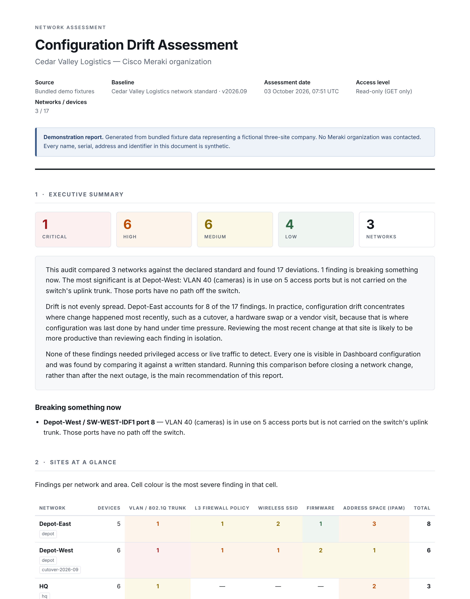

# Meraki Config Auditor

[](https://github.com/michaeljavyee/meraki-config-auditor/actions/workflows/ci.yml)

Read-only configuration drift and compliance auditor for Cisco Meraki. It pulls
configuration from every network in an organization through the Dashboard API,
compares it against a declared baseline in YAML, and produces an assessment
report: findings with evidence, business risk and remediation, sequenced by
consequence. A second mode treats network configuration as code: export live
config to YAML, then `plan` shows exactly what would have to change for the
network to match it.

I built it after root-causing an outage that came down to a single VLAN missing
from an uplink trunk after a switch cutover. The cameras behind that switch had
power and link, the switch showed green in Dashboard, and nothing alerted. This
is the tool that would have caught it before the change was closed.



**[View the sample report →](https://michaeljavyee.github.io/meraki-config-auditor/reports/sample_report.html)**

## Try it with zero setup

```bash
pip install -r requirements.txt
python -m src.audit --demo --format html
open reports/audit_demo.html
```

No Meraki account, no API key, no network access. `--demo` runs the full
pipeline against bundled fixtures for a fictional three-site company and
produces the same report a live organization would:

| Site | What happened |
|---|---|
| **HQ** | The reference site. One latent gap: an IDF uplink doesn't carry the camera VLAN, and nothing there needs it *yet*. A 2019 "kiosk" reservation leaves the guest DHCP pool 93% full, and the lobby printer's reserved address is held by a conference-room TV. |
| **Depot-East** | Two years of small changes: a native VLAN mismatch on one link, a broad SNMP allow for a vendor, a guest SSID that still allows WPA1, a reservation typed outside its subnet, one for a printer recycled years ago, and a subnet HQ's lab VLAN copied. |
| **Depot-West** | Cut over to new switching in September. The replacement IDF switch's uplink was rebuilt by hand without VLAN 40, so five yard cameras are offline. Also a "TEMP" firewall rule that silently disables guest isolation, an open installer SSID bridged into the corp VLAN, and a consumer router at the wash bay handing out 192.168.1.x. |

The fixtures are generated by [`scripts/generate_fixtures.py`](scripts/generate_fixtures.py),
where each site's story is commented in one place.

## What it checks

| Check | Flags | Top severity |
|---|---|---|
| **VLAN / 802.1Q trunks** | A VLAN in use on a switch's access ports but not carried on its uplink. Native VLAN mismatch across both ends of a link. Baseline-required VLANs missing from an uplink. | Critical |
| **L3 firewall drift** | Non-standard rules that **shadow** a baseline rule (first-match makes the baseline rule dead code), missing baseline denies, broad undocumented allows, reordering. | High |
| **SSID consistency** | Authentication, encryption, VLAN and radio settings that differ from the standard; enabled SSIDs the standard doesn't know about. | High |
| **Firmware drift** | Devices behind, ahead of, or mixed with peers relative to the approved version for their product type. | Medium |
| **Address space (IPAM)** | Subnet overlap within and between sites; DHCP pools near exhaustion once reserved ranges and reservations are subtracted; reservations that can't be served, are held by another device, or are for hardware that's gone; clients on addresses outside every subnet (rogue DHCP). | High |

The IPAM check reconciles what configuration says (subnets, pools,
reservations) with what clients are actually using over the last 7 days, and
the report includes a per-VLAN address-space table. It's scoped honestly: I
haven't run Infoblox or phpIPAM in production. I built this to understand
where address-space management actually breaks, using data Dashboard already
has; it doesn't model DNS, IPv6, or address space managed outside Meraki.

Severity is set by **consequence, not by distance from the baseline**. One
missing number in an allowed-VLAN list is an outage. A dozen band-steering
differences are a tidy-up. Definitions are in the report and in
[`src/scoring.py`](src/scoring.py).

## Configuration as code: `export` and `plan`

The audit asks *is this network compliant with our standard?* The second half
of the tool asks *is it configured the way we said it would be?*, and answers
the way `terraform plan` does.

```bash
python -m src.export --demo --output intent/mine.yaml   # live config -> YAML
python -m src.plan --demo                                # intent vs live -> plan
```

```diff
~ network["Depot-West"].switch_port["SW-WEST-IDF1"]["8"]   # Uplink
    ~ allowedVlans : "1,10,20,30" -> "1,10,20,30,40"   (+40)

~ network["Depot-West"].l3_firewall_rules   # 4 rules -> 3 rules (0 added, 1 removed)
    - [was #1] ALLOW any VLAN(30).*:Any -> Any:Any  "TEMP vendor access during cutover - remove after"

+ network["Depot-West"].appliance_vlan[50]   # Badge readers
    + name        = "Badge readers"
    + subnet      = "10.30.50.0/24"
    + applianceIp = "10.30.50.1"

Plan: 1 to add, 8 to change, 0 to destroy.
```

- **`export`** snapshots a hand-built network as YAML: the starting point for
  managing it as code. Export, then plan against the export, and the plan is
  empty; a test holds that property.
- **`plan`** compares an intent file (or a directory, one file per site) with
  live config. Only declared attributes are managed, so a network can be
  adopted one section at a time, starting with what hurts when it drifts:
  uplinks, firewall, SSIDs. VLAN lists compare as sets and changes are
  annotated (`+40`); firewall rules diff as an ordered list, so one inserted
  rule is one addition, not every later rule "changing".
- **Exit codes** match `terraform plan -detailed-exitcode` (0 none, 2 changes,
  1 error), and `--format markdown` produces a PR comment, so a pipeline can
  run plan on every intent change and on a schedule to catch drift.
- **There is no `apply`.** A tool that can change production networks is a
  liability in a portfolio unless its guardrails are obvious, and the honest
  first step is a plan you trust. The reasoning, and what apply would need
  before it exists, is in [`docs/config-as-code.md`](docs/config-as-code.md).

The demo intent, [`intent/demo/cedar-valley.yaml`](intent/demo/cedar-valley.yaml),
is the approved design for the demo org. Its plan is the change list that
would fix every drift the audit found, plus one approved-but-unbuilt VLAN.

## Design decisions

- **Read-only, enforced mechanically.** Every request goes through one method
  in [`src/meraki_client.py`](src/meraki_client.py) that is hardcoded to `GET`.
  CI fails the build if a write verb appears anywhere in `src/`, or if anything
  outside the client imports `requests`. The claim can't quietly stop being true.
- **The standard is a file.** The baseline is YAML so it can be reviewed in a
  pull request and versioned with the change that motivated it. See
  [`docs/baseline-format.md`](docs/baseline-format.md).
- **One code path.** `--demo` swaps the API client for a fixture-backed client
  with the same interface. The checks can't tell the difference, so the demo
  exercises the real logic.
- **No double counting.** When one root cause would produce several findings
  (a VLAN that's both in use and baseline-required, a native mismatch that's
  also non-standard), only the most specific one is reported.
- **Failure modes are documented.** Where the inferences break is written down
  in [`docs/false-positives.md`](docs/false-positives.md).
- **It can gate a change.** `--fail-on critical` exits non-zero, so the audit
  can be the last step of a cutover runbook or a scheduled pipeline.

## Running against a real organization

```bash
cp .env.example .env      # set MERAKI_API_KEY (and MERAKI_ORG_ID if the key sees several orgs)
python -m src.audit --baseline baselines/example.yaml --format all
```

A read-only organization admin key is sufficient. For a no-cost live target,
reserve the **Meraki Sandbox** at [devnetsandbox.cisco.com](https://devnetsandbox.cisco.com):
a dedicated organization with a virtual MX, MS, MR and MV, read-only, for up to
a day. You need a free Meraki account; accept the org invite DevNet sends, then
generate an API key inside that org. Its configuration will differ from the
example baseline, so expect findings; that's the point.

### Options

```
--demo                       run against bundled fixtures; no account needed
--baseline PATH              baseline YAML (default: baselines/example.yaml)
--org-id ID                  organization to audit (or MERAKI_ORG_ID)
--format {terminal,html,csv,all}
--output PATH                output path stem for html/csv
--checks a,b                 subset of: vlan_trunks, firewall, ssids, firmware, ipam
--fail-on {never,critical,high}   exit 2 when findings at/above this severity exist
-v, --verbose
```

## Layout

```
src/
  meraki_client.py     GET-only Dashboard API client: Link pagination, 429 Retry-After, actionable errors
  demo_client.py       fixture-backed client with the same interface
  baseline.py          YAML baseline loader and validation
  scoring.py           Finding model, severity definitions, VLAN-list parsing
  checks/
    base.py            OrgContext: lazy, cached, shared reads
    vlan_trunks.py     trunk / native VLAN consistency
    firewall_drift.py  L3 rule drift and shadowing
    ssid_consistency.py
    firmware_drift.py
    ipam.py            subnet overlap, DHCP pools, reservations, rogue addresses
  report.py            HTML, CSV and terminal renderers
  audit.py             audit CLI
  state.py             live config -> intent-shaped data (managed attributes only)
  intent.py            intent YAML loader and validation
  diff.py              intent vs live -> plan (create / update / delete)
  render_plan.py       plan as text, Markdown, JSON
  export.py            export CLI
  plan.py              plan CLI
templates/report.html.j2
baselines/example.yaml
intent/demo/cedar-valley.yaml
scripts/generate_fixtures.py
docs/
tests/
```

## Status and roadmap

**v0.3.** Five audit checks including IPAM reconciliation (v0.3), `export`
and `plan` for configuration as code (v0.2), demo mode,
HTML/CSV/terminal/Markdown/JSON output, CI. The original audit was validated
end to end against a live Cisco DevNet Meraki Sandbox organization; what that
run found and what changed as a result is in
[`docs/live-validation.md`](docs/live-validation.md). The IPAM check, `export`
and `plan` read through the same client and haven't had their own live run yet.

Planned, in order:

1. **Uplink detection from LLDP topology**, as a fallback when uplinks aren't
   tagged (the gap the live run exposed).
2. **Switch port drift:** access vs trunk, native VLAN, 802.1X/access policy,
   STP guard, against per-role port profiles.
3. **Orphaned objects:** policy objects and group policies nothing references.
4. **802.1X / NAC posture:** which ports enforce, which fall back to MAB, and
   where a bypass is possible.
5. **More resources under `plan`:** group policies, DHCP reservations, switch ACLs.

## Tests

```bash
python -m pytest -q
```

Unit tests cover each check against small hand-built configurations, the
demo story end to end, the client's pagination, retry and error handling,
HTML escaping of Dashboard-supplied strings, the IPAM pool arithmetic and each reservation failure mode, and for `plan`: the
export-then-plan-is-empty round trip, exit codes, set semantics for VLAN
lists, ordered firewall diffs, exclusive deletion, and intent validation.

## Related

[okta-nhi-audit-tool](https://github.com/michaeljavyee/okta-nhi-audit-tool): the
same architecture applied to non-human identities in Okta.
